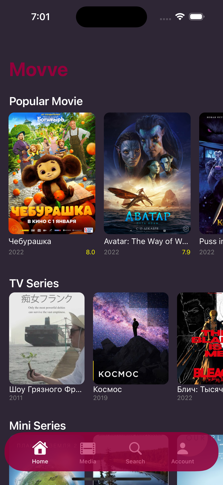
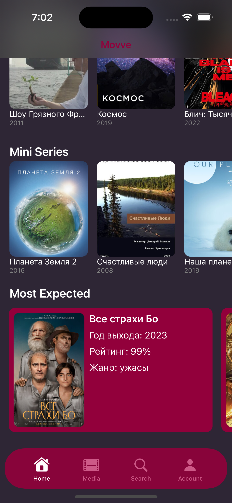
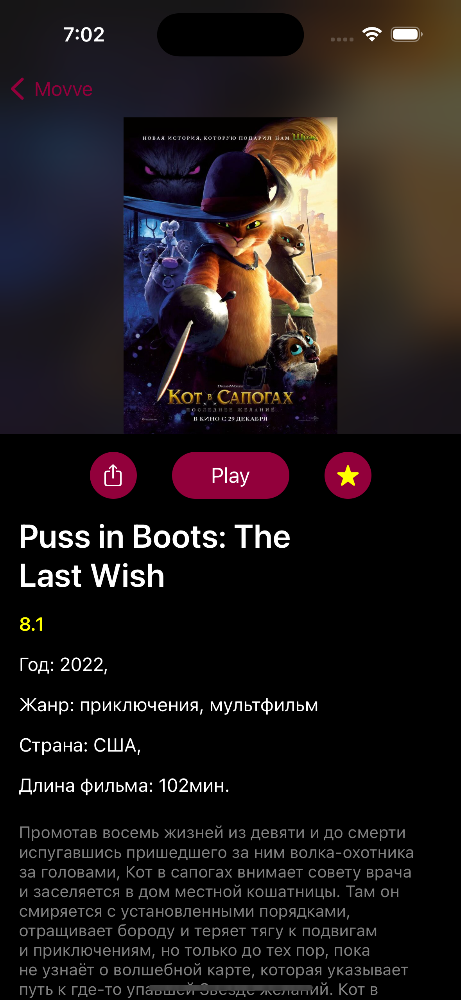
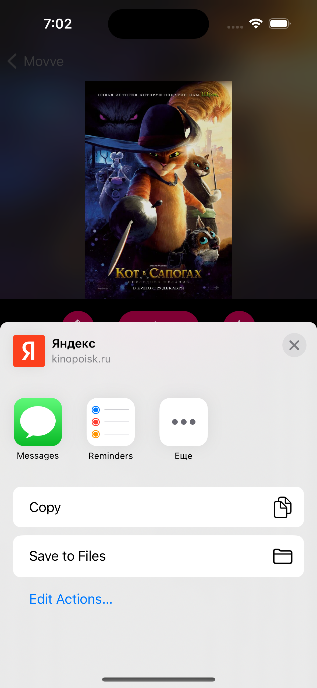
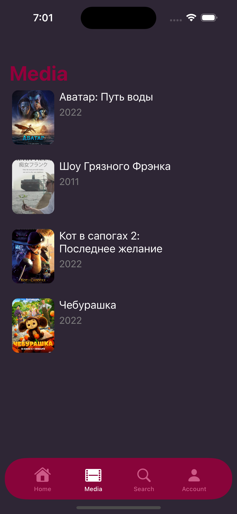
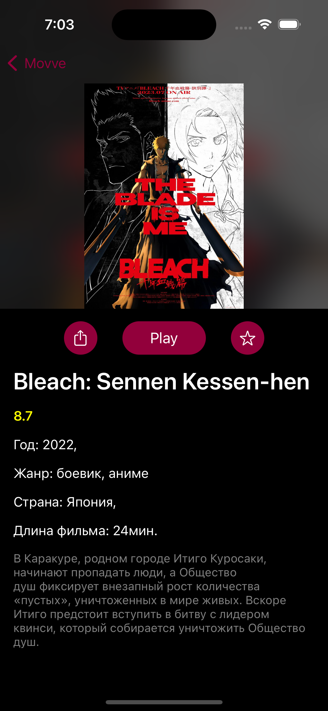

# App "Movve" (PopularMovie рабочее название) для IOS 16.2

## Приложение Movve – это идеальный способ для любителей кино оставаться в курсе свежих релизов.

## Скриншоты приложения

<html>
 <body>
  <p>
    
    
    
    
    
    
  </p>
 </body>
</html>

## [Ссылка на Youtube с приложением](https://youtu.be/bx0jbFgX5MQ)

## Функции

- Просмотр актуальных и свежих фильмов и сериалов по категориям - "Популярные Фильмы", "Сериалы", "Мини Серии" и "Самые ожидаемые".

- Детальное описание фильма - Название, год, Постер, Длина фильма, Жанры, Описание

- Кнопка "Поделиться ссылкой на фильм"

- Переход к просмотру фильма на сайте Кинопоиска

- Добавление фильма в избранное

## Стэк технологий

- Swift 5.7 - язык программирования 

- UIKit - фреймворк верстки интерфейсов (Основная работа с UICollectionView)

- MVC - архитектурный паттерн

- CoreData - работа с хранилищем (CRUD funcs

- GCD 

- Singleton Core Data

- API - kinopoiskapiunofficial.tech

- Singleton Service

- ChatGPT - в роли консультанта :)

- Dependency Injection

## Уникальные фишки

- Парящий TabBar, прячется и исчезает при переходе на Detail

- Приятный снеппинг ячеек с фильмами, вместо обычного скролла

## Установка

1. Создать папку

2. В терминале проложить путь в папку

3. ``` git init ```

4. ``` git clone https://github.com/0xYanis/PopularMovie ```

5. Открыть в XCode

6. Подключить IPhone по кабелю к ПК и выбрать в списке девайсов в XCode свой IPhone

7. ``` command + r ```

## Время работы с проектом

Начало: 08.02.2023

Конец: 19.02.2023

## Проблемы

UI:

1. При открытии новых экранов (переход в Кинопоиск) и возврате, находясь в Detail, в последствии TabBar начнет некорректно отображаться, когда будет вызван (сдвинется выше)

2. Жестко заданная выосота ячейки с описанием фильма в Detail (длина описания может меняться)

Business Logic:

1. Лимит 500 реквестов в день по этому API

2. CRUD методы CoreData работают с конкретной сущностью, что станет проблемой при расширении БД.

3. [connection] nw_connection_add_timestamp_locked_on_nw_queue [C2] Hit maximum timestamp count, will start dropping events

Для исправления этой ошибки необходимо оптимизировать код приложения для более эффективного использования сетевого соединения.

Например использовать кеширование или уменьшить количество запросов к серверу.
